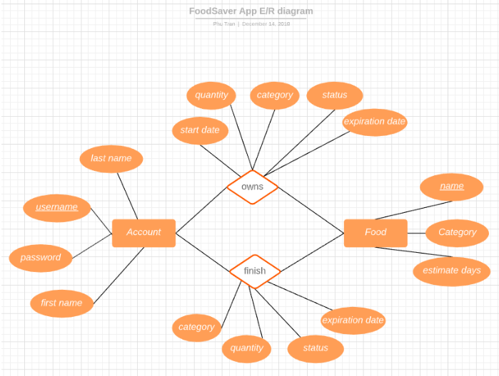

# CS160-FoodManagement (FoodSavier) Application

### Motivation
Food waste is a problem worth solving for many reasons. At a personal level, users can get their money’s worth of the food they purchase and more accurately estimate the amount of food they should buy on a regular basis. At the global level, preventing or minimizing food waste will reduce our carbon footprint and help improve the environment.

### Methodology
Apply: Agile methodology
Tools: Android Studio, Adobe XD, GitHub, Taigo.io (project management website)
Language: Java and XML
database: SQLite

### Application Demo
Below is the link that lead to the demo of our application:
https://www.youtube.com/watch?v=2NHOKAQHmF4&feature=youtu.4be

### E/R diagram for the application

### Application outline
#### Prototypes

#### Final Look

